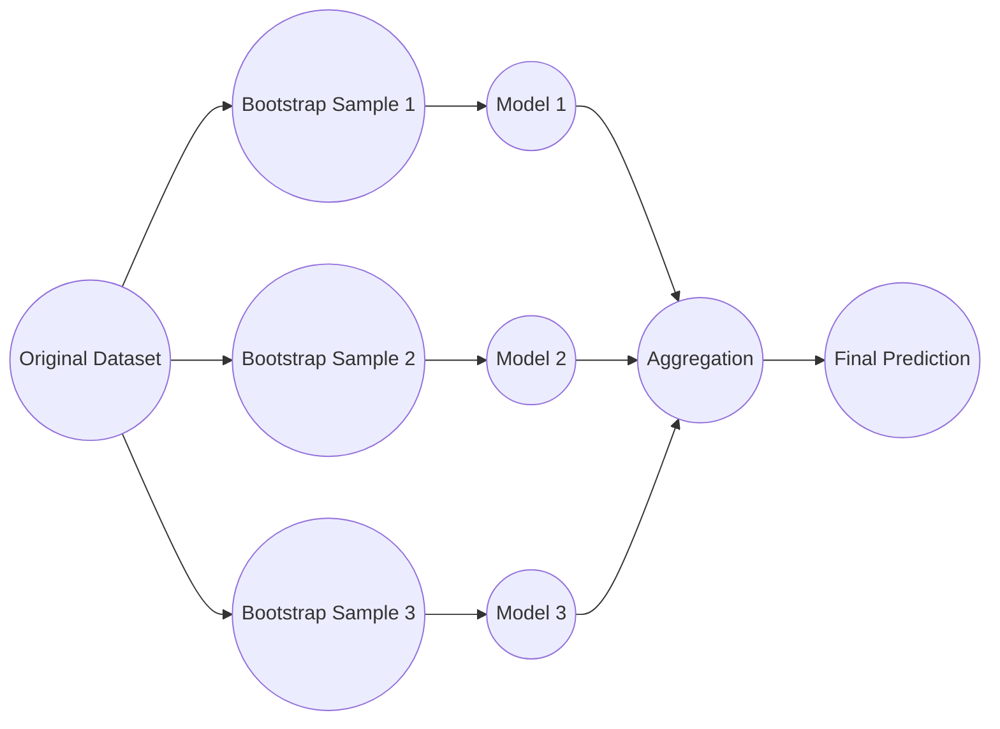
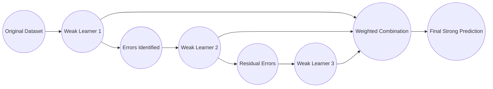
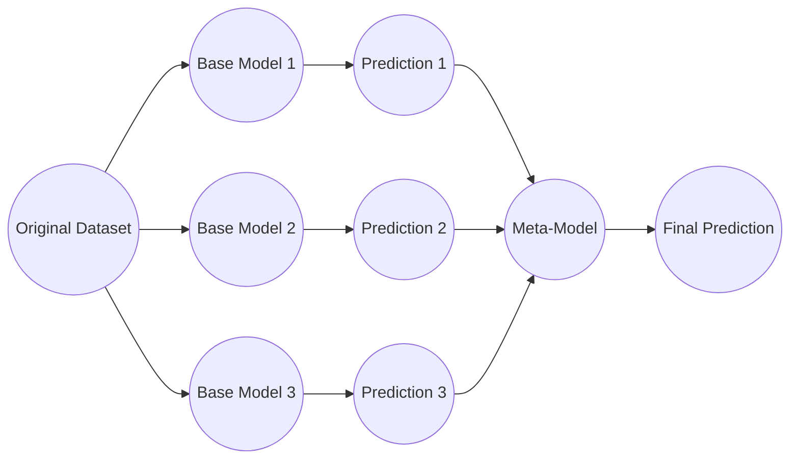

# 1. Intro
## 1.1 Def
- **Task** (T): The specific problem the system aims to solve (ex: ==classification, prediction, clustering==).
- **Performance Measure** (P): The metric used to evaluate how well the system is performing (e.g., ==accuracy, error rate==).
- Experience (E): The training data, such as examples, labels, or trial-and-error interactions, that the model processes to optimize its internal parameters.
Example:
`A robot driving learning problem: How to drive a robotic automobile autonomously?`
- T: Drive safely to destination
- P: Average distance, safety score
- E: Driving data

## 1.2 ML Process
1. Data preparation
2. Algorithm and model development
3. Final evaluation using the test
4. Integrate into application
---

# 2. Intro 2
## 2.1 Data mining
Process:
- Data gathering
- Data preparation
- Mining the data
- Data Analysis and interpretation

## 2.1 Type of ML
- Supervised Learning: Training with labeled data
	- Classification:
		- Linear
		- Polynomial
	- Regression:
		- k-Nearest Neighbor (kNN)
		- Decision Tree, Random Forest
		- Logistic Regression
		- Naïve-Bayes, Support Vector Machine (SVM)
- Unsupervised Learning: Training with unlabeled data
	- Clustering:
		- K-means
		- Gaussian Mixture Models (GMMs)
- Reinforcement Learning: take action in the environment then received state update and feedbacks
	- ![[Pasted image 20260507185549.png]]

## 2.2 Problem
- Regression problem
	- Predict a continuous value
- Classification problem
	- Predict a category
- Clustering problem
	- Group similar data without predefined labels
- Anomaly detection Problem
	- Detect unusual or abnormal data
- Decision Making and planning problem
---

## 2.3 Pipeline
#### Standard
Data > Train classifier > Model > Prediction
#### Complete
![[Pasted image 20260507203905.png]]
> Data Collection: Web scraping, databases, API's, IoT devices, public datasets
> Data Validation: Ensuring data integrity, accuracy, consistency, verifying
> Data Preprocessing: Cleaning, Integration, Transformation, Reduction  
> Model Training: Choose the most appropriate model for training
> 	- Type of problem: Classification, regression, clustering
> 	- Data characteristic: Size, dimension, linearity
> Model Tuning: Improve model performance through parameter optimization
> 	- Grid Search
> 	- Random Search
> 	- Bayesian optimization
> Model Analysis
> 	- Accuracy
> 	- precision
> 	- Recall
> 	- F1 Score
> 	- etc.
> Model Validation: Evaluating the model performance on validation dataset.
> 	- Detect overfitting and underfitting
> 	- Cross validation
> Model Deployment: take the trained ML and making it to use
> 	- Hosting, running, API's, UI, etc.
> Model feedback: Continuous process of monitoring and maintaining model
---

# 3. Feature Engineering
## 3.1 Feature Creation
Generating new feature according to domain knowledge or observing pattern in the data.
- ==Domain Specific== Example:
	- Healthcare: Calculating "time since last hospital admission" to ==predict== readmission.
	- Finance: Creating features that represent “frequency of transactions in last 24 hours" for fraud detection.
- ==Data Driven== Example:
	- Aggregation: ==Aggregating data== such as calculating the mean, sum, or std.
	- Interaction Features: ==Combining multiple features==, such as dividing the "Total Charge" by "Total Minutes" to create a "Cost per Minute" metric.
- ==Synthetic: Combined existing feature==
	- Mean std median
 
## 3.2 Feature Transformation
- Scaling
	- Adjust range feature to consistency
- Log Transform
	- Handle Skewed distribution
- Encoding
	- Converts categorical data to numerical form
- Binning
	- Group values into intervals 
		- Equal frequency
		- Equal width
		- Smoothing
			- Mean
			- Median
			- Boundaries

## 3.3 Feature Selection
==Choosing a ***subset*** of relevant features from the original dataset==
- ==Filter Method==
	- Correlation Coefficient: Select features highly correlated with the target and minimally correlated with each other.
	- Chi-Square Test: Evaluates relationships between categorical features and the target variable.
- ==Wrapper methods==
## 3.4 FEATURE EXTRACTION
==***Transforming*** the original features into a new, lower dimensional==
- ==Dimensionality Reduction Techniques==:
	- Principal Component Analysis (PCA): Reduces the number of features by projecting data onto a lower-dimensional space, retaining the most variance.
	- Singular Value Decomposition (SVD): Another method to reduce dimensionality by decomposing the data matrix into component matrices.
- ==Text Feature Extraction==: Bag of Words, TF-IDF.
- ==Image Feature Extraction==: CNN
## 3.5 PCA Steps
1. Standardize Data
2. Compute Covariance matrix
3. Compute eigenvectors and eigen values
4. Select top PC's
5. Transform data

## 3.6 Calculation
![[Pasted image 20260509112940.png]]

---

# 4. MODEL EVALUATION, SAMPLING & OPTIMIZATION
## 4.1 Performance Metrics from Confusion Matrix
![[Pasted image 20260518113414.png]]
## 4.2 Data Sampling
- Random Sampling: shuffling the dataset and ==randomly== assigning samples to training, validation, or test sets according to predetermined ==ratios==.
- Stratified Sampling: commonly used with imbalanced datasets.
- Bootstap: creating multiple random samples with replacement from the original dataset

## 4.3 Comparison High Bias and High Variance
![[Pasted image 20260518115220.png]]

## 4.4 Hyperparameter Tuning
==They are set before training==.
Influence model complexity, learning speed, and performance.
- Techniques: ![[Pasted image 20260518115349.png]]

## 4.5 Using multi-core CPU
- None = single CPU Core
- 4 = 4 CPU Core
- -1 = All Available CPU Core
---

# 5 MODEL LEARNING STRATEGIES AND KNN
## 5.1 Lazy Learning
Learning happen during prediction
- Store training data
- Delay learning until prediction
Useful when:
- Data changes frequently
- Low training cost
- However, prediction becomes computationally expensive thus it is not suitable for real- time systems
## 5.2 Parametric Algorithm
Models that assume a specific functional form for the relationship between input features and output.
![[Pasted image 20260518160412.png]]

## 5.3 Non-Parametric Algorithm
models that do not assume predefined functional form for the relationship between input features and output.
![[Pasted image 20260518163801.png]]
## 5.4 Instance-Based and Model-Based ML
![[Pasted image 20260518164148.png]]

## 5.5 KNN
kNN predicts a data point's label based on the ==majority vote== of its ==closest== neighbors k.
k-NN belongs to instance-based learning:
- Predictions are made using stored examples
- No explicit model is built
- It relies entirely on similarity between data points (distance function)
KNN predicts based on distance between data points.
- For classification → most common label among neighbors
- For regression → average value of neighbors
![[Pasted image 20260520173522.png]]![[Pasted image 20260520173615.png]]
Number of Neighbors (k)
Small (1-3):
- Capture fine details
- Entitative to noise
- Over fitting (High Variance)
Large (10-20):
- Produces smoother decision boundaries
- May ignore local structure
- High Bias (Underfitting)
Practical: starting range 3-15 neighbor

Weight strategy:
- Uniform Weight:
	- Example:
		k = 5 neighbors:
		• 3 Red
		• 2 Blue
		Prediction → Red
(All neighbors treated equally)
- Distance-Based Weight:
	- Example:
		k = 5 neighbors:
		• 2 very close Blue
		• 3 far Red
		Uniform ⟶ Red
		Distance-based ⟶ Blue (closer points dominate)

Ideal data for kNN
- Low Dimensionality
- Well-Scaled
- Clean and Labeled
- Numeric Features
Avoid KNN:
- Large Dataset
- High Dimensional data
- Imbalance Classes
- Missing Values
Advantages of KNN:
- Simple to implement
- No training phases
- Adapts quickly
- Non-Parametric
Disadvantages of KNN:
- Computationally  Expensive
- Memory Intesive
- Stensitive to outliers
- Curse of Dimensionality
### KNN Exercise
![[Pasted image 20260528183053.png]]
#### Step 1: Compute Manhattan Distance ($d = |x_1 - x_2| + |y_1 - y_2|$)

For each row, we subtract the new point's coordinates $(20, 35)$ and sum the absolute differences:

1. **Row 1 (40, 20):** $|40 - 20| + |20 - 35| = 20 + 15 =$ **35**
    
2. **Row 2 (50, 50):** $|50 - 20| + |50 - 35| = 30 + 15 =$ **45**
    
3. **Row 3 (60, 90):** $|60 - 20| + |90 - 35| = 40 + 55 =$ **95**
    
4. **Row 4 (10, 25):** $|10 - 20| + |25 - 35| = 10 + 10 =$ **20**
    
5. **Row 5 (70, 70):** $|70 - 20| + |70 - 35| = 50 + 35 =$ **85**
    
6. **Row 6 (60, 10):** $|60 - 20| + |10 - 35| = 40 + 25 =$ **65**
    
7. **Row 7 (25, 80):** $|25 - 20| + |80 - 35| = 5 + 45 =$ **50**
    

#### Step 2: Sort, Filter by $k=5$

Sorting our calculated distances from nearest (smallest) to farthest gives us our top 5 closest neighbors:

- **1st Nearest:** Distance = 20 $\rightarrow$ **Red**
    
- **2nd Nearest:** Distance = 35 $\rightarrow$ **Red**
    
- **3rd Nearest:** Distance = 45 $\rightarrow$ **Blue**
    
- **4th Nearest:** Distance = 50 $\rightarrow$ **Blue**
    
- **5th Nearest:** Distance = 65 $\rightarrow$ **Red**
    

(Note: The remaining points at distances 85 and 95 are discarded because $k=5$.)

#### Step 3: Vote
**Final Count:** $\text{Red} = 3$, $\text{Blue} = 2$.

> **Conclusion:** By majority vote, the new data point $(20, 35)$ is classified as **Red**.


# No chap 6 btw

# 7. DECISION TREES, AND ENSEMBLE LEARNING
Why tree models?
- Work with mixed data types
- Require minimal preprocessing
- Handle nonlinear relationships 
- Easy to interpret 
- Scale well 
- Perform strongly on tabular datasets
## 7.1 Decision Tree
==Supervised== learning algorithm used for both ==classification== and ==regression==.

### 7.1.1 Splitting Criteria
To ==find the best feature to split the data== on
#### Gini Impurity
Measures how "==impure==" a node is. The ==lower== the Gini Impurity, the ==better== the feature splits the data into distinct categories.
$$\huge Gini = 1- \sum^n_{i=1} p_i^2$$
#### Entropy
Measures the amount of ==uncertainty== or ==disorder== in the data. The tree tries to ==reduce== the entropy by ==splitting== the data on features that provide the most information about the target variable.
$$\huge Entropy = - \sum^n_{i=1} p_i \times log _2(p_i)$$
![[Pasted image 20260528191642.png]]
#### Information Gain
Measures the ==effectiveness== of an attribute in classifying the training instances based on the
concept of entropy from information theory.
$$\huge Information\:Gain= Entropy(parent)-\sum(\frac{N_v}{N}\times Entropy(child))$$
Where:
- $N$ is the total number of instances in the parent node.
- $N_v$ is the number of instances in the child node v.
- Entropy (parent) is the entropy of the parent node.
- Entropy (child v) is the entropy of the child node v.
The attribute with the **==highest information gain==** is chosen as the ==splitting attribute== at each node, as it ==maximally reduces the entropy== and thus provides the ==most information== about the class labels.

#### Example

##### Problem Statement
* **Initial Population ($S$):** There are 40 people in a group.
  * Play Basketball: 10 people.
  * Do Not Play: 30 people.

##### Step 1: Entropy of the Original Dataset
* $P(\text{Play}) = \frac{10}{40} = 0.25$
* $P(\text{Not Play}) = \frac{30}{40} = 0.75$

$$\text{Entropy}(S) = -[0.25 \log_{2}(0.25) + 0.75 \log_{2}(0.75)]$$
$$\text{Entropy}(S) = -(-0.5 - 0.311)$$
$$\text{Entropy}(S) \approx \mathbf{0.811}$$
##### Step 2: Entropy of Set A
* **Total People:** 15
  * Play Basketball: 8 ($P = \frac{8}{15} \approx 0.533$)
  * Do Not Play: 7 ($P = \frac{7}{15} \approx 0.467$)

$$\text{Entropy}(A) = -[0.533 \log_{2}(0.533) + 0.467 \log_{2}(0.467)]$$
$$\text{Entropy}(A) = -(-0.483 - 0.514)$$
$$\text{Entropy}(A) \approx \mathbf{0.997}$$

##### Step 3: Entropy of Set B
* **Total People:** 25
  * Play Basketball: 2 ($P = \frac{2}{25} = 0.08$)
  * Do Not Play: 23 ($P = \frac{23}{25} = 0.92$)

$$\text{Entropy}(B) = -[0.08 \log_{2}(0.08) + 0.92 \log_{2}(0.92)]$$
$$\text{Entropy}(B) = -(-0.292 - 0.110)$$
$$\text{Entropy}(B) \approx \mathbf{0.402}$$
##### Step 4: Weighted Entropy After Split
To see if the split was effective, calculate the combined entropy proportional to the size of each child group:
* $\text{Weight A} = \frac{15}{40} = 0.375$
* $\text{Weight B} = \frac{25}{40} = 0.625$

$$\text{Entropy\_split} = (\text{Weight A} \times \text{Entropy A}) + (\text{Weight B} \times \text{Entropy B})$$
$$\text{Entropy\_split} = (0.375 \times 0.997) + (0.625 \times 0.402)$$
$$\text{Entropy\_split} \approx \mathbf{0.625}$$

##### Step 5: Information Gain
Information Gain is the difference between original parent entropy and the split entropy:

$$\text{Information Gain} = \text{Entropy}(S) - \text{Entropy\_split}$$
$$\text{Information Gain} = 0.811 - 0.625$$
$$\text{Information Gain} \approx \mathbf{0.186}$$
##### Step 6: Split Information
Split Information measures the potential intrinsic information generated by splitting the training dataset into subsets:

$$\text{SplitInfo} = -[(\frac{15}{40}) \log_{2}(\frac{15}{40}) + (\frac{25}{40}) \log_{2}(\frac{25}{40})]$$
$$\text{SplitInfo} = -(-0.531 - 0.424)$$
$$\text{SplitInfo} \approx \mathbf{0.955}$$

##### Step 7: Gain Ratio
Finally, calculate the overall Gain Ratio to determine feature effectiveness:

$$\text{Gain Ratio} = \frac{\text{Information Gain}}{\text{SplitInfo}}$$
$$\text{Gain Ratio} = \frac{0.186}{0.955}$$
$$\text{Gain Ratio} \approx \mathbf{0.195}$$
### 7.1.2 Build a Decision Tree
General Process:
- Start with the whole dataset.
- Choose the best attribute.
- Split data into subsets.
- Split further if needed (Recursive splitting).
- Assign final decisions (Leaf nodes).
- Use the Tree for predictions.

How Decision Trees Work:
```mermaid
graph TD;
    id1((Root Node: Starts with a question)) --> id2((Branching: Yes));
    id1 --> id3((Branching: No));
    id2 --> id4((Leaf Node: Reaches final decision));
    id3 --> id5((Leaf Node: Reaches final decision));
````

Example Dataset:

| **Day** | **Outlook** | **Temp** | **Humidity** | **Wind** | **Play Tennis** |
| ------- | ----------- | -------- | ------------ | -------- | --------------- |
| D1      | Sunny       | Hot      | High         | Weak     | No              |
| D2      | Sunny       | Hot      | High         | Strong   | No              |
| D3      | Overcast    | Hot      | High         | Weak     | Yes             |
| D4      | Rain        | Mild     | High         | Weak     | Yes             |
| D5      | Rain        | Cool     | Normal       | Weak     | Yes             |
| D6      | Rain        | Cool     | Normal       | Strong   | No              |
| D7      | Overcast    | Cool     | Normal       | Strong   | Yes             |
| D8      | Sunny       | Mild     | High         | Weak     | No              |
| D9      | Sunny       | Cool     | Normal       | Weak     | Yes             |
| D10     | Rain        | Mild     | Normal       | Weak     | Yes             |
| D11     | Sunny       | Mild     | Normal       | Strong   | Yes             |
| D12     | Overcast    | Mild     | High         | Strong   | Yes             |
| D13     | Overcast    | Hot      | Normal       | Weak     | Yes             |
| D14     | Rain        | Mild     | High         | Strong   | No              |

Step-by-Step Tree Construction Walkthrough:

- **Step 1 (Root Split):** ==Evaluate Information Gain== for all attributes. ==`Outlook` yields the highest gain (0.248)==. Splitting on `Outlook` generates three branches: `Sunny`, `Overcast`, and `Rain`. The `Overcast` branch is pure and terminates immediately in a `Yes` decision.
- **Step 2 (Sunny Sub-tree):** For the remaining instances down the `Sunny` branch, `Humidity` yields the highest gain (0.971). Splitting on `Humidity` splits the data perfectly into pure outcomes: `High` $\rightarrow$ `No` and `Normal` $\rightarrow$ `Yes`.
- **Step 3 (Rain Sub-tree):** For instances down the `Rain` branch, `Wind` yields the highest gain (0.971). Splitting on `Wind` splits the remaining data into pure outcomes: `Strong` $\rightarrow$ `No` and `Weak` $\rightarrow$ `Yes`.

Final Completed Tree:
```mermaid
graph TD;
    id1((Outlook)) -->|Sunny| id2((Humidity));
    id1((Outlook)) -->|Overcast| id3((Yes));
    id1((Outlook)) -->|Rain| id4((Wind));
    
    id2((Humidity)) -->|High| id5((No));
    id2((Humidity)) -->|Normal| id6((Yes));
    
    id4((Wind)) -->|Strong| id7((No));
    id4((Wind)) -->|Weak| id8((Yes));
```
Stopping Condition:

- Trees stop splitting when they reach a **==Pure Class==** (where Entropy = 0).
- Typical early stopping conditions to prevent growing a full tree:
    - Stop if all instances belong to the exact same class.
    - Stop if all available attribute values are identical.
    - Stop if expanding the current node yields no improvement in impurity measures.

### 7.1.3 Tree Depth and Complexity

==Shallow== Trees:
- Simple
- ==High bias==
- ==Underfitting== risk

==Deep== Trees:
- Highly flexible
- ==Low bias==
- ==High variance==
- Create many tiny partitions, highly specific rules, and memorization behavior (e.g., creating highly specific conditions for only a few training samples).
- Learn noise, random fluctuations, and dataset-specific patterns during training.

Tree ==Pruning==:
- ==Pre==-pruning: Halt the tree growth early using ==constraints== such as ==max depth==, ==minimum samples== per node, or strict impurity ==thresholds==.
- ==Post==-pruning: Grow a ==fully== complex tree first, then ==systematically remove weak== or non-significant ==branches==.
- Benefits: Noticeably improves generalization, ==operational robustness==, and ==model simplicity==.

### 7.1.4 Feature Scaling in Tree-Based Models

- Tree splits are calculated using rules based on numeric thresholds and value orderings.
- Normalizing or scaling numeric values will not alter the structural ranking or relative split positions.
- ==No Need for Feature Scaling==: Unlike geometric or distance-based algorithms like SVM or KNN, decision trees are scale-invariant because they handle features independently and only compare values within a single attribute.

### 7.1.5 Ideal Data for Decision Trees

- ==Non-linear== Relationships: Trees excel at mapping complex, non-linear patterns where multi-feature interactions are non-obvious.
- ==Unscaled== Data: Works out of the box without requiring prior normalization or scaling.
- Missing Values: Many implementations natively account for missing data via surrogate splits or feature exclusions during structural calculations.
- ==Outliers==: Robust to extreme values because data partitioning isolates regions; isolated extreme values rarely shift the macro tree boundaries.

### 7.1.6 When to Avoid Using Decision Trees

- ==Strictly Linear== Data: If features share an explicitly clear linear relationship, standard linear models routinely outperform and remain far more stable than tree partitions.
- ==High Dimensionality==: Datasets possessing a massive feature count relative to active samples cause trees to overfit heavily by memorizing data noise instead of structural trends.
- ==Smooth Trends==: Regression trees render piecewise constant steps, rendering them poorly suited for estimating smooth continuous shifts or extrapolating outside training boundaries.

### 7.1.7 Advantages of Decision Trees

- Interpretability: ==Easy to read==, comprehend, and visually map, which clarifies feature importance metrics and specific decision-making criteria.
- ==Non-linear== Relationships: Seamlessly isolates complex interactions between variables and target targets.
- ==No Need for Feature Scaling==: Entirely eliminates structural preprocessing configurations like standardizing or min-max scaling.

### 7.1.8 Disadvantages of Decision Trees

- ==Overfitting==: Highly susceptible to overfitting, particularly as depth expands. Setting manual structural constraints or performing systematic pruning is vital.
- ==Instability==: Minor adjustments to the base training data can produce an entirely different tree structure, making the model structurally fragile.
- ==High-variance==: Categorized fundamentally as low-bias but high-variance machine learning models.

## 7.2 ENSEMBLE LEARNING
combine multiple models and aggregate predictions.
Ensemble learning might improve:
- Robustness
- Stability
- Generalization

Disadvantages;
- Large models becomes hard to explain (reduced interpretability)
- Higher computational cost
- More complex deployment
- Diminishing returns

Ideal dataset:
- Large
- Has noise
- Feature interaction are complex
- Non linear relationship exist
- Predictive performance prioritized over interpretability
### 7.2.3 Type
#### Bagging (Bootstrap Aggregating)

- ==Train multiple models Independently== then ==combine== their predictions
- Final: 
	- majority voting (classification)
	- averaging (regression)
#### Boosting

- Models are trained one after another, focuses on ==fixing the errors made by the previous ones==.
- Final: ==weighted combination== of all models, which helps ==reduce bias== and ==improve accuracy==.
#### Stacking (Stacked Generalization)

- Multiple ==different models are trained== and ==their predictions are used as inputs== to a final model, called a ==meta-model==.
- The meta-model learns ==how to best combine the predictions== of the base models, aiming for ==better performance than any individual model==.

### 7.2.4 Learning Techniques
![[Pasted image 20260607124544.png]]
1. Random Forest:
	![[Pasted image 20260607125820.png]]
	Each tree evaluates ==random parts== of the data and their ==results are combined== by voting for classification or averaging for regression. This helps in improving ==accuracy== and ==reducing errors.== When building each tree it ==doesn’t look at all the features (columns) at once==. It ==picks a few at random== to decide how to ==split the data==. This helps the trees ==stay different== from each other.
	1. Random forest extend decision tree by:
		- training many trees
		- using random subsets of samples
		- using random subsets of features
		- ==combining predictions== from many trees
	2. Advantages:
		- ==Accurate predictions== even with large datasets.
		- Doesn’t require feature scaling
		- Reduces the risk of overfitting of the model.
	3. Disadvantages:
		- ==Computationally expensive==: >> number of trees.
		- Interpretability becomes harder
2. GRADIENT BOOSTING MACHINES (GBM)
	![[Pasted image 20260607133005.png]]
	GBM build an ensemble of shallow and weak successive trees with each tree learning and  improving on the previous
	1. Learning rate (n):
		- ![[Pasted image 20260607135013.png]]
3. ADABoost
	![[Pasted image 20260607135506.png]]
	- ==Combines multiple weak classifiers to build a strong model==. 
	- It trains models ==sequentially==, each correcting previous errors.
	- Assigns ==higher weights to misclassified samples==.
	- Final prediction is made using ==weighted voting==.
	Limitation:
	- ==Accuracy increase== when added ==more weak learner== which leads to ==overfitting==
	- Underperforms in the presence of noise
	- Slower to train
	- Hyperparameters is difficult
	Advantages:
	- Suited for imbalance dataset
4. XGBoost (eXtreme Gradient Boosting)
	extreme version of the previous gradient boosting algorithm. perform better than GBM
	difference: uses a regularization technique 


5. CATBoost
	Categorical boosting. ==Performs best on categorical datasets==. 
	- suited for ==large-scale datasets== with many independent features
	- handle both ==categorical and numerical features seamlessly== 
	- It uses ==Symmetric Weighted Quantile Sketch== (SWQS) algorithm which helps in handles ==missing values==, ==reduces overfitting== and ==improves model performance==
	Parameters:
	- cat_features: An array of indices for categorical features
	- one_hot_max_size: used for one-hot encoding in a categorical feature.
	Categorical feature:
	- Nominal Categorical Features:
		- No inherent order 
	- Ordinal Categorical Features:
		- Categories with a meaningful order (maybe encoded with integer values)
![[Pasted image 20260607161833.png]]

# 8. SUPPORT VECTOR MACHINE (SVM)
![[Pasted image 20260607163556.png]]
Supervised learning algorithm usually used for ==classification tasks==, but can also be adapted to ==regression== and ==outlier detection== tasks.
Find the optimal hyperplane that maximizes the margin (best line or decision boundary)
Support vectors: data points or vectors that are the closest to the hyperplane. These vectors support the hyperplane.
- if there are ==2 features==, then the hyperplane will be a ==straight line==.(1D)
- If there are ==3 features==, then the hyperplane will be a ==2D plane==.(2D)
- if there is 1 feature, then hyperplane will be dot (0D)

Ideal Data for SVM:
- **==Small to Medium==** Datasets(< 100k samples)
- **==High-Dimensional Data==**
- **==Clear Margin of Separation==**:Performs optimally when there is a distinct gap between the classes
- **==Unstructured Data==**: where features outnumber samples.

Avoid SVM if:
- **==Very Large Datasets**==
- ==**Noisy or Overlapping Data**==
- ==**Imbalanced Classes==**

Advantages:
- **==Effective in High Dimensional Spaces==**
- **==Memory efficient==**
- **==Kernel trick versality==**
- **==Robust to overfitting**==

Disadvantages:
- ==**High Training time==**
- **==Difficult to tune==**
- **==Hard to understand**==

## 8.1 Multiclassification SVM
SVM can support ==multiclass classification== too, BUT internally it usually combines multiple binary classifiers:
- ==One vs Rest== (OvR)
	Final prediction is based on ==highest confidence score==
	- Class A vs others
	- Class B vs others
	- Class C vs others
- ==One VS One== (OvO)
	Final prediction is based on ==majority voting==
	- Class A vs B
	- Class A vs C
	- Class B vs C

## 8.2 Type of SVM
![[Pasted image 20260607171600.png]]
### 8.2.1 Linear SVM
- In linear SVM the separating hyperplane is: $w\times x +b=0$
- margin in SVM is given by: $\huge margin = \frac{1}{||w||}$
	- This is why SVM tries to minimize ||w|| to maximize the margin
### 8.2.2 Non-Linear SVM
To separate these data points, ==one more dimension is added==
	a third dimension z is added $z = x^2+y^2$ (circle plane)
![[Pasted image 20260607175906.png]]

## 8.3 SVM Kernel
![[Pasted image 20260607181101.png]]
### 8.3.1 Linear Kernel
Used when data is already linearly separable.
Advantages:
- ==Simple==, fast to compute
- ==Effective for linearly== separable data
Disadvantages:
- ==Not suitable== for complex, ==non-linear data==

### 8.3.2 Polynomial Kernel
Allows for more ==complex decision boundaries== by adding ==polynomial features== to the data.
Can capture interactions between features up to a certain degree.
Advantages:
- Can model interactions between features
- Suitable for ==non-linearly separable data==
Disadvantages:
- ==Not suitable== for complex, ==non-linear data==
- ==Computationally more expensive== than the linear kernel.
- ==Risk of overfitting== with high-degree polynomials

### 8.3.3 RBF Kernel (Radial Basis Function) 
Also known as ==Gaussian kernel==. This kernel can handle ==very complex== and non-linear relationship.
Advantages:
- Can handle wide range of data distribution
- ==Effective in high-dimensional== spaces
Disadvantages:
- Requires ==careful tuning== of the ==gamma parameter==
- ==Computationally more expensive== with large datasets
Function:
$$\huge K(x_i,x_j)=e^{-\gamma||x_i-x_j||^2}$$
Where:
- Gamma, $\gamma$ controls the influence range
Smaller distance -> Higher kernel -> Higher similarity
Larger distance -> Lower kernel -> Lower similarity

## 8.4 Effect of Gamma ($\gamma$)
$\gamma$ controls how strongly distance affects similarity. Defines the behavior of the decision boundary.
![[Pasted image 20260607184454.png]]
Low 𝛾 → Higher kernel → Higher similarity
High 𝛾 → Lower kernel → Lower similarity

#### Example:
A SVM model uses RBF Kernel: $\huge K(x_i,x_j)=e^{-\gamma||x_i-x_j||^2}$
Given: $||x_i-x_j||$ = 1.5
Calculate the kernel value when:
- 𝛾 = 0.5
- 𝛾 = 1.5
𝜸 = 0.5
K = 0.3247 (Higher similarity)
𝜸 = 1.5
K = 0.0342

### 8.5 How to Choose the Right Kernel
- **==Data Complexity==**: For ==linearly== separable data, the ==linear kernel== is sufficient. For more ==complex== data, consider ==polynomial or RBF== kernels.
- ==**Computational Resources**==: RBF and polynomial kernels are computationally more intensive than the linear kernel. Ensure that your computational resources can handle the increased complexity.
- **==Model Performance==**: Experiment with ==different kernels and use cross-validation== to determine which ==kernel yields the best performance== for your specific problem.

# 9. ARTIFICIAL NEURAL NETWORKS (ANN) & MULTILAYER PERCEPTRON (MLP)
![[Pasted image 20260607222748.png]]
Interconnected artificial neurons to learn pattern from data and make predictions.
Node layer of ANN consist:
- ==input layer==: ==accept input== from outside environment. Receive the data it needs to process
- three or more ==hidden layer==: ==Complex computation happen==
- ==output layer==: ==Answer== or prediction
## 9.1 Single-Layer NN (Perceptron)
Consists of an ==**input layer and an output neuron**==.
Fundamental model for ==binary classification problems==.
single-layer perceptron ==cannot solve non-linearly separable== problems like **XOR**